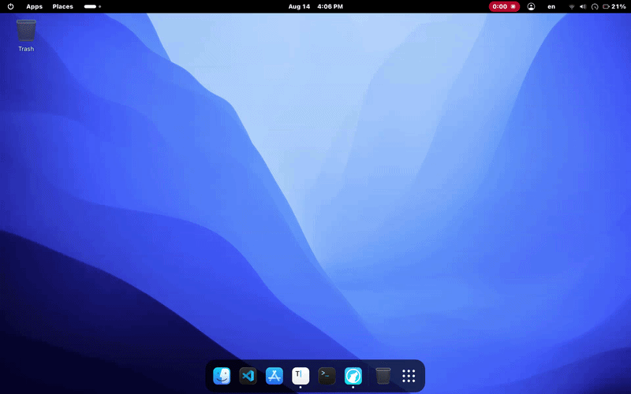

# Desktop in Switcher

GNOME Alt-Tab extension for switching to the desktop.

Desktop in Switcher adds a desktop entry to the GNOME Shell Alt-Tab window switcher, making it quick to show the desktop without leaving the keyboard.



## Features

- Adds a desktop entry to the Alt+Tab switcher
- Uses the GNOME Shell Alt-Tab popup injection flow
- Provides a clean compatibility guard for supported Shell versions
- Uses GNOME gettext so labels follow the system language
- Keeps translations in locale files instead of hardcoding UI text
- Includes translations for German, Spanish, French, Italian, Portuguese, Russian, and Turkish

## Supported GNOME Versions

This project targets the modern GNOME Shell ESM line:

- GNOME Shell 45
- GNOME Shell 46
- GNOME Shell 47
- GNOME Shell 48
- GNOME Shell 49
- GNOME Shell 50

GNOME Shell 44 and older are not supported in this branch. GNOME 45 was the ESM migration point, so the extension uses the modern module-based extension format and intentionally rejects unsupported Alt-Tab APIs instead of running on incompatible Shell versions.

## Requirements

- GNOME Shell 45–50
- gettext, for compiling translation files during installation

## Install

```bash
sudo dnf install -y gettext
cd desktop-in-switcher
./install.sh
```

The installer validates the active GNOME Shell version and exits early if the system is not in the supported range.

If this is the first install, log out and log back in:

```bash
gnome-session-quit --logout
```

Then enable the extension:

```bash
gnome-extensions enable desktop-in-switcher@teskilatsiz
```

## Compatibility Notes

This extension uses the modern GNOME extension API for Shell 45+ and checks the `AltTab.WindowSwitcherPopup` implementation before injecting into the popup lifecycle.

If a future Shell version changes the internal Alt-Tab structure in a way that is not supported by this extension, the module fails explicitly instead of silently breaking the desktop switcher flow.

## Project Structure

```text
extension.js              Extension source (GNOME 45–50 ESM compatible)
metadata.json             GNOME Shell extension metadata
install.sh                Local per-user installer with version checks
uninstall.sh              Local uninstaller
po/                       Translation sources
update-translations.sh    Translation refresh helper
```

## Translations

Translation sources are stored in:

```text
po/
```

Included locales:

- de
- es
- fr
- it
- pt
- ru
- tr

To refresh the template:

```bash
./update-translations.sh
```

## Uninstall

```bash
./uninstall.sh
```

## License

[MIT](LICENSE)
