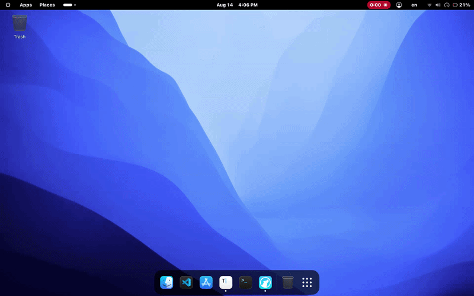

# Desktop in Switcher

GNOME Alt-Tab extension for switching to the desktop.

Desktop in Switcher adds a desktop entry to the Alt+Tab switcher, so you can jump straight to the desktop without taking your hands off the keyboard.



## Features

- Adds Desktop to both GNOME switcher types
- Minimizes visible windows on the active workspace
- Follows the system language through gettext translations
- Supports GNOME 45-50

## Requirements

- GNOME Shell 45–50
- gettext

## Install

Clone the repository, install gettext, and run the installer:

```bash
git clone https://github.com/teskilatsiz/desktop-in-switcher.git
cd desktop-in-switcher
sudo dnf install -y gettext
./install.sh
```

Enable the extension in the current session:

```bash
gnome-extensions enable desktop-in-switcher@teskilatsiz
```

The installer reloads the extension automatically when updating an enabled copy. If you installed it from GNOME Extensions, disable and re-enable it after an update. Logging out is not needed to enable it.

## Project Structure

```text
extension.js              Extension source
metadata.json             GNOME Shell extension metadata
install.sh                Local per-user installer with version checks
uninstall.sh              Local uninstaller
po/                       Translation sources
update-translations.sh    Translation refresh helper
```

## Package

Build the upload package:

```bash
gnome-extensions pack . --force --podir=po --gettext-domain=desktop-in-switcher@teskilatsiz
```

The generated ZIP only includes the extension source, metadata, and compiled locale files.

## Translations

Translation sources are stored in:

```text
po/
```

Included locales:

- de
- es
- fr
- it
- pt
- ru
- tr

To refresh the template:

```bash
./update-translations.sh
```

## Uninstall

```bash
./uninstall.sh
```

## License

[MIT](LICENSE)
